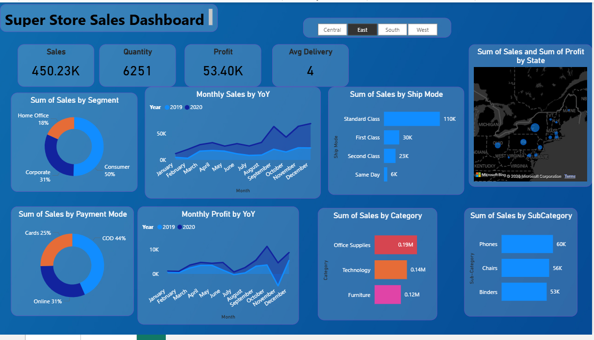

# Super-Sales-Store-Dashboard
## project-objective
Super Store Sales Dashboard built using Power BI to analyze sales, profit, customer segments, and trends with interactive visualizations for data-driven business decisions.

# Dataset used
-  📂 <a href="https://drive.google.com/drive/folders/1HDkNHNslI3rgCv9LZzGtxag8JvYzss-b" target="_blank">Super Store Sales Dataset</a>

# 📊 KPI Questions from Dashboard View
- What is the total Sales, Quantity, Profit, and Avg Delivery time shown in the top cards?
- Which customer segment has the highest share in the Sales by Segment chart?
- What is the percentage contribution of each segment (Consumer, Corporate, Home Office)?
- How do monthly sales trends compare between 2019 and 2020?
- In which month is the highest sales peak observed?
- Which shipping mode has the highest sales, and which has the lowest?
- Which payment mode is used the most by customers?
- Which category (Office Supplies, Technology, Furniture) generates the highest revenue?
- Which sub-category has the highest sales (Phones, Chairs, Binders)?
- Which state shows the highest sales and profit on the map?
## 📊 Dashboard Preview

# 📊 Dashboard Development Process
-1.Data Collection & Cleaning
Gathered Super Store dataset and performed data cleaning (handled missing values, corrected data types).
-2.Data Modeling
Structured data into proper format, created relationships, and prepared it for analysis in Power BI.
-3.Visualization & KPI Creation
Designed interactive visuals (charts, maps) and created KPIs like Sales, Profit, Quantity, and Delivery Time.
-4.Insights & Optimization
Analyzed trends, identified top-performing segments/categories, and optimized dashboard for better decision-making.

# 📊 Final Conclusion
The Super Store Sales Dashboard provides a clear view of overall business performance by highlighting key metrics like sales, profit, and quantity. It reveals that the Consumer segment and Office Supplies category drive the highest sales, while Standard Class shipping is the most preferred. Monthly trends show growth patterns and seasonal variations, helping identify peak periods. Additionally, regional insights highlight top-performing states. Overall, the dashboard enables better decision-making by uncovering opportunities to improve profitability, optimize operations, and focus on high-performing areas.

